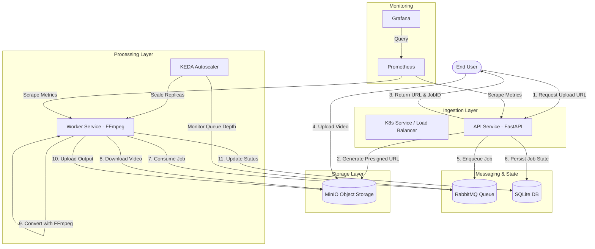

# Cloud Video Conversion System

A distributed, event-driven microservices application for scalable video processing using FastAPI, RabbitMQ, MinIO, FFmpeg, and KEDA autoscaling on Kubernetes.

> [!TIP]
> **New to the project?** Check out the [In-Depth Architecture & Workflow Guide](docs/ARCHITECTURE_AND_WORKFLOW.md) for a deep dive into how components interact.

## 🏗️ Architecture



## 📋 Prerequisites

- **Docker Desktop** with Kubernetes enabled
- **kubectl** CLI tool
- **Helm** 3.x (for KEDA and Prometheus)
- **Git** (to clone this repository)

### Enable Kubernetes in Docker Desktop

1. Open Docker Desktop Settings
2. Go to **Kubernetes** tab
3. Check **Enable Kubernetes**
4. Click **Apply & Restart**
5. Wait for Kubernetes to start (green icon in status bar)

## 🚀 Quick Start

### Option 1: Docker Compose (Local Development)

```bash
# Clone the repository
cd "Cloud Video Conversion System"

# Start all services
docker-compose up -d

# Check service status
docker-compose ps

# View logs
docker-compose logs -f
```

**Access Points:**
| Service | URL |
|---------|-----|
| API | http://localhost:8000 |
| API Docs | http://localhost:8000/docs |
| RabbitMQ Management | http://localhost:15672 (guest/guest) |
| MinIO Console | http://localhost:9001 (minioadmin/minioadmin) |
| Prometheus | http://localhost:9090 |
| Grafana | http://localhost:3000 (admin/admin) |

> [!NOTE]
> To test **Scalability Metrics** in Grafana, you can scale the worker service manually:
> ```bash
> docker-compose up -d --scale worker=3
> ```
> Prometheus will automatically discover the new worker instances.

### Option 2: Kubernetes Deployment

```bash
# Build Docker images
docker build -t video-api:latest -f api/Dockerfile .
docker build -t video-worker:latest -f worker/Dockerfile .

# Create namespace and apply manifests
kubectl apply -f k8s/namespace.yaml
kubectl apply -f k8s/configmap.yaml
kubectl apply -f k8s/database-pvc.yaml
kubectl apply -f k8s/rabbitmq.yaml
kubectl apply -f k8s/minio.yaml
kubectl apply -f k8s/api-deployment.yaml
kubectl apply -f k8s/worker-deployment.yaml

# Install KEDA
helm repo add kedacore https://kedacore.github.io/charts
helm repo update
helm install keda kedacore/keda -n keda --create-namespace

# Apply KEDA scaling
kubectl apply -f k8s/keda-scaledobject.yaml

# Install Prometheus Operator
helm repo add prometheus-community https://prometheus-community.github.io/helm-charts
helm install prometheus prometheus-community/kube-prometheus-stack \
  -n monitoring --create-namespace

# Check deployment status
kubectl get pods -n video-processing
```

## 📚 API Reference

### Upload Video

**Step 1: Request upload URL**
```bash
curl -X POST http://localhost:8000/upload/request \
  -H "Content-Type: application/json" \
  -d '{"filename": "my_video.avi", "content_type": "video/avi"}'
```

Response:
```json
{
  "upload_url": "http://minio:9000/videos/uploads/abc123.avi?...",
  "object_path": "uploads/abc123.avi",
  "job_id": "550e8400-e29b-41d4-a716-446655440000",
  "expires_in": 3600
}
```

**Step 2: Upload file to presigned URL**
```bash
curl -X PUT "UPLOAD_URL_FROM_STEP_1" \
  -H "Content-Type: video/avi" \
  --data-binary @my_video.avi
```

### Create Conversion Job

```bash
curl -X POST http://localhost:8000/jobs \
  -H "Content-Type: application/json" \
  -d '{
    "input_path": "uploads/abc123.avi",
    "output_format": "mp4"
  }'
```

### Check Job Status

```bash
curl http://localhost:8000/jobs/{job_id}
```

### List All Jobs

```bash
curl "http://localhost:8000/jobs?status=completed&limit=50"
```

### Download Converted Video

```bash
curl http://localhost:8000/download/{job_id}
```

## 📊 Monitoring

### Grafana Dashboards

The system includes a pre-configured Grafana dashboard with these panels:

1. **Throughput** - Videos processed per minute
2. **Scalability** - Queue depth vs worker pods (dual axis)
3. **Error Rates** - Errors per minute by type
4. **Conversion Performance** - P50/P95/P99 latencies

### Prometheus Metrics

| Metric | Type | Description |
|--------|------|-------------|
| `api_requests_total` | Counter | Total API requests by endpoint |
| `api_ingestion_rate_total` | Counter | Video uploads and job creations |
| `api_request_duration_seconds` | Histogram | API request latency |
| `worker_jobs_processed_total` | Counter | Jobs processed by status |
| `worker_conversion_time_seconds` | Histogram | FFmpeg conversion time |
| `worker_failure_rate_total` | Counter | Failures by type |
| `worker_active_jobs` | Gauge | Currently processing jobs |

## 🧪 Load Testing

### Using Locust

```bash
# Start main services first
docker-compose up -d

# Start Locust
docker-compose -f docker-compose.locust.yml up -d

# Open Locust UI
# http://localhost:8089
```

**Recommended test settings:**
- **Number of users:** 50
- **Spawn rate:** 5 users/second
- **Host:** http://api:8000

### Test Scenarios

1. **VideoProcessingUser** - Simulates normal user behavior
   - Request upload URL
   - Create conversion jobs
   - Poll job status
   - Download completed videos

2. **BurstUser** - Simulates spike traffic
   - Rapid job creation
   - Tests autoscaling behavior

## 🔥 Fault Tolerance Demos

### Demo 1: Kill Worker Pod

Demonstrates job recovery when a worker pod fails mid-processing.

```bash
# Make script executable (Git Bash on Windows)
chmod +x scripts/fault-tolerance/kill-worker.sh

# Run demo
./scripts/fault-tolerance/kill-worker.sh
```

**Expected behavior:**
1. Worker pod is terminated
2. Job message is re-queued in RabbitMQ
3. Another worker picks up the job
4. Job completes successfully

### Demo 2: Kill FFmpeg Process

Demonstrates recovery when FFmpeg crashes inside a worker.

```bash
./scripts/fault-tolerance/kill-ffmpeg.sh
```

**Expected behavior:**
1. FFmpeg process is killed
2. Worker detects failure
3. Message is NACKed and re-queued
4. Job is retried by a worker

### Demo 3: Kill MinIO Pod

Demonstrates StatefulSet recovery for persistent storage.

```bash
./scripts/fault-tolerance/kill-minio.sh
```

**Expected behavior:**
1. MinIO pod is terminated
2. StatefulSet recreates the pod
3. PVC is re-attached
4. All data is preserved

### Demo 4: Inject Network Latency

Demonstrates system resilience under degraded network conditions.

```bash
./scripts/fault-tolerance/inject-latency.sh
```

**Expected behavior:**
1. Network latency is added to worker pod
2. Job processing slows down but continues
3. Grafana shows increased P95/P99 conversion times
4. No job failures or message loss

### Demo 5: Inject CPU Pressure

Demonstrates system behavior under resource contention.

```bash
./scripts/fault-tolerance/inject-cpu-pressure.sh
```

**Expected behavior:**
1. Worker experiences high CPU usage
2. FFmpeg conversion slows significantly
3. KEDA may trigger additional worker scaling
4. Jobs eventually complete successfully

## ⚙️ Configuration

### Environment Variables

| Variable | Default | Description |
|----------|---------|-------------|
| `RABBITMQ_HOST` | rabbitmq | RabbitMQ hostname |
| `RABBITMQ_PORT` | 5672 | RabbitMQ port |
| `RABBITMQ_USER` | guest | RabbitMQ username |
| `RABBITMQ_PASSWORD` | guest | RabbitMQ password |
| `RABBITMQ_QUEUE` | video-jobs | Queue name |
| `MINIO_ENDPOINT` | minio:9000 | MinIO endpoint |
| `MINIO_ACCESS_KEY` | minioadmin | MinIO access key |
| `MINIO_SECRET_KEY` | minioadmin | MinIO secret key |
| `MINIO_BUCKET` | videos | Bucket name |
| `DATABASE_PATH` | /data/jobs.db | SQLite database path |

### FFmpeg Settings

| Variable | Default | Description |
|----------|---------|-------------|
| `FFMPEG_OUTPUT_FORMAT` | mp4 | Default output format |
| `FFMPEG_VIDEO_CODEC` | libx264 | Video codec |
| `FFMPEG_AUDIO_CODEC` | aac | Audio codec |
| `FFMPEG_PRESET` | medium | Encoding speed/quality |
| `FFMPEG_CRF` | 23 | Quality (0-51, lower=better) |

## 🔧 Troubleshooting

### Common Issues

**1. Pods stuck in Pending state**
```bash
kubectl describe pod <pod-name> -n video-processing
```
Usually due to insufficient resources or missing PVCs.

**2. Worker not connecting to RabbitMQ**
```bash
kubectl logs -l app=worker -n video-processing
```
Check RabbitMQ is ready and credentials are correct.

**3. MinIO bucket not created**
```bash
kubectl logs job/minio-init -n video-processing
```
Ensure MinIO pod is healthy before init job runs.

**4. KEDA not scaling**
```bash
kubectl get scaledobject -n video-processing
kubectl describe scaledobject worker-scaledobject -n video-processing
```
Check KEDA is installed and RabbitMQ connection is valid.

### Useful Commands

```bash
# View all resources
kubectl get all -n video-processing

# Check KEDA scaling
kubectl get hpa -n video-processing

# View worker logs
kubectl logs -f -l app=worker -n video-processing

# Port forward services
kubectl port-forward svc/api 8000:8000 -n video-processing
kubectl port-forward svc/rabbitmq 15672:15672 -n video-processing
kubectl port-forward svc/minio 9001:9001 -n video-processing

# Scale workers manually
kubectl scale deployment worker --replicas=5 -n video-processing
```

## 📁 Project Structure

```
Cloud Video Conversion System/
├── api/
│   ├── main.py              # FastAPI application
│   ├── requirements.txt     # Python dependencies
│   └── Dockerfile
├── worker/
│   ├── worker.py            # Video processing worker
│   ├── requirements.txt     # Python dependencies
│   └── Dockerfile
├── shared/
│   ├── __init__.py
│   ├── config.py            # Shared configuration
│   ├── models.py            # Pydantic models
│   └── database.py          # SQLite operations
├── k8s/
│   ├── namespace.yaml
│   ├── configmap.yaml
│   ├── database-pvc.yaml
│   ├── rabbitmq.yaml
│   ├── minio.yaml
│   ├── api-deployment.yaml
│   ├── worker-deployment.yaml
│   └── keda-scaledobject.yaml
├── monitoring/
│   ├── prometheus.yml
│   └── grafana/
│       ├── provisioning/
│       └── dashboards/
├── scripts/
│   └── fault-tolerance/
│       ├── kill-worker.sh
│       ├── kill-ffmpeg.sh
│       └── kill-minio.sh
├── tests/
│   └── load/
│       └── locustfile.py
├── docker-compose.yml
├── docker-compose.locust.yml
└── README.md
```

## 📄 License

This project is for educational and demonstration purposes.

## 🤝 Contributing

1. Fork the repository
2. Create a feature branch
3. Make your changes
4. Submit a pull request
