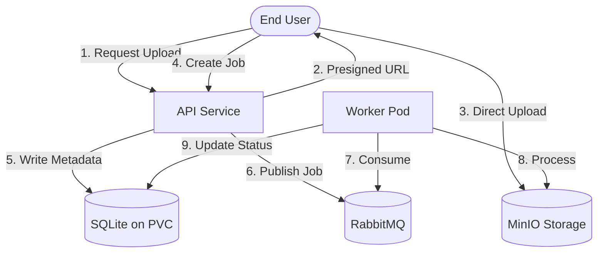

Scalable & Resilient Cloud Video Conversion System
Cheong Hoi Chun, Sabin Bhandari

## Abstract

This report details the design, implementation, and evaluation of a cloud-native video conversion system deployed on Kubernetes. The system utilizes a distributed, event-driven architecture to handle high-variance workloads efficiently. Key components include a FastAPI-based gateway, RabbitMQ for asynchronous messaging, stateless workers for video transcoding, and KEDA for event-driven autoscaling. By leveraging Minikube for local emulation, we demonstrate the system's ability to scale from zero to multiple replicas based on queue depth, maintain data integrity through fault tolerance mechanisms, and provide real-time observability via Prometheus and Grafana.

## Table of Contents

1. [Introduction](#1-introduction)
2. [Background](#2-background)
3. [System Architecture](#3-system-architecture)
    - 3.1 [Architecture Overview](#31-architecture-overview)
    - 3.2 [High-Level Data Flow](#32-high-level-data-flow)
    - 3.3 [Technology Stack](#33-technology-stack)
4. [Methodology and Implementation](#4-methodology-and-implementation)
    - 4.1 [Video Conversion Service Design](#41-video-conversion-service-design)
    - 4.2 [Load Generation and Closed-System Workload](#42-load-generation-and-closed-system-workload)
    - 4.3 [Monitoring and Metrics](#43-monitoring-and-metrics)
    - 4.4 [Autoscaling Strategy (KEDA + RabbitMQ)](#44-autoscaling-strategy-keda--rabbitmq)
5. [Evaluation](#5-evaluation)
    - 5.1 [Baseline Performance](#51-baseline-performance)
    - 5.2 [Scalability](#52-scalability)
    - 5.3 [Reliability and Fault Tolerance](#53-reliability-and-fault-tolerance)
    - 5.4 [Resource Utilisation](#54-resource-utilisation)
6. [Discussion](#6-discussion)
    - 6.1 [Interpretation of Results](#61-interpretation-of-results)
    - 6.2 [Limitations and Future Work](#62-limitations-and-future-work)
7. [Conclusion](#7-conclusion)
8. [References](#8-references)

---

## List of Abbreviations

| Abbreviation | Definition |
|---|---|
| ACID | Atomicity, Consistency, Isolation, and Durability |
| API | Application Programming Interface |
| CPU | Central Processing Unit |
| HPA | Horizontal Pod Autoscaler |
| KEDA | Kubernetes Event-driven Autoscaling |
| PVC | Persistent Volume Claim |
| QoS | Quality of Service |

---

## 1. Introduction

The digital media landscape is dominated by video content. As of 2025, video traffic is projected to account for approximately 82% of all internet traffic (Demand Sage, 2025). The rise can be attributed to the rise of streaming services, social media and remote collaboration tools (Cisco Annual Internet Report (2018–2023): White Paper). In the first half of 2024, video traffic was dominated by social media, with YouTube, Instagram, and Tiktok video in the top three (Kemp, 2025). Similarly video streaming services have seen growth of over 15% YoY while at least 90% of the younger people watch video content every week (Applogic Network, 2025). The rise in video content consumption seems to be on rise due to the meteoric rise in online gaming and game-live streaming (El Afi & Ouiddad, 2021).

The multimedia sector is experiencing rapid growth as more businesses and organizations turn to video to communicate with their customers and other stakeholders (Moina-Rivera et al., 2024). To meet these increasing demands, businesses need a flexible and scalable platform that can handle large amounts of data and traffic (Tang et al., 2023). The cloud provides an ideal solution for this as it offers features like pay-as-you-go pricing, elastic scalability, reduced IT overhead and faster time to market (Moina-Rivera et al., 2024). However, high-quality video across a fragmented ecosystem of devices including mobile, web browsers, smart devices, requires transcoding, a process of converting a video file from one encoding format to another. It ensures compatibility, bandwidth efficiency, consistency and compatibility in a platform. However, transcoding is an inherently compute and I/O-intensive operation and their traffic patterns are often unpredictable with sudden high bursts followed by periods of low activity. Static or monolithic architectures are not suitable for these conditions as they risk oversubscribing or undersubscribing during high demand and resource wasting during off-periods (Tang et al., 2023). These conditions motivate the design of scalable, fault-tolerant cloud-native service that can match the workload while maintaining reliability.

In response to these challenges, this project implements a scalable and resilient cloud-native video transcoding system that leverages a decoupled event-driven architecture. The project also performs validation through fault injections and conducting high-concurrency load testing to measure system robustness. The report contributes a blueprint for a simple but reliable video processing system that balances performance with durability.

## 2. Background

Video transcoding is an inherently resource-intensive process involving converting an encoded video from one format, codec, resolution, or bitrate to another. A simple video transcoding pipeline comprises ingestion, transcoding and distribution. The transcoding stage dominates the computational cost and time depending on the video duration, resolution, and codec complexity.

Monolithic architectures struggle with media processing because transcoding is I/O intensive and unpredictable, blocking request handlers and preventing horizontal scaling. Microservices architectures decompose the system into loosely coupled, independently deployable services that communicate asynchronously. The producer-consumer pattern is particularly effective for transcoding: an API service (producer) accepts job submissions and immediately returns a job ID to the client, while dedicated worker pods (consumers) asynchronously process jobs from a queue. This decoupling enables the API to remain responsive under load and allows workers to process jobs at their own pace, scaling independently based on queue depth. Furthermore, containerization platforms like Kubernetes provides necessary orchestration layer to manage these distributed components offering deployment, resource isolation, autoscaling, and self-healing capabilities that are critical for maintaining QoS in cloud-native media workflows (Moina-Rivera et al., 2024).

Message broker, like RabbitMQ, are suited for this pattern as it supports durable queues and manual acknowledgements. Manual consumer Acknowledgement, as opposed to Auto Acknowledgement, ensures that a message is only removed from the queue after the consumer has successfully processed it. This ensures the job status preservation even if the consumer crashes during processing.

Similarly, an architecture where API handles both metadata and upload can become a bottleneck especially for large video uploads. The video files can typically range from tens to hundreds of megabytes, and routing these uploads through API service would create bottlenecks in terms of memory consumption, network bandwidth, and request processing. Presigned URL reduces API’s I/O load and enables traffic offloading by allowing the client to upload files directly to object storage. API generates temporary cryptographically signed URL to grant the write access and only controls metadata, authorization and storage location.

Kubernetes provides native autoscaling capabilities through HPA, which adjusts the number of the pod replicas based on CPU/Memory usage metrics. However, research has identified significant limitations of CPU/Memory-based scaling for queue-driven workloads as they react too slowly to sudden bursts in tasks. Additionally, traditional HPA cannot scale deployments to zero replicas, resulting in constant baseline costs even during extended idle periods. An event-driven approach is required to scale the processing power in direct proportion to the work backlog. KEDA addresses these limitations by enabling scaling based on event sources rather than resource utilization metrics (Lumesberger, 2024).

In distributed cloud systems, component failures like pod or node crashes, network timeouts are inevitable. These failure occurrences must be mitigated through robust application design. The methodology of “Chaos Engineering”, whereby faults are injected into the system to test its resilience, has become a standard validation technique. By simulating such failure scenarios, we can verify the recovery mechanisms function as intended before a real incident occurs.

Similarly, monitoring is crucial for effective management of microservice architecture. Prometheus and Grafana have become the de facto standard for cloud-native observability, providing a powerful, scalable, and flexible solution for monitoring microservices. Prometheus’ robust data collection and alerting with Grafana’s rich visualization capabilities offers a comprehensive monitoring solution suitable for modern microservices environments. Additionally, incorporating effective error monitoring is essential for maintaining the health and performance of microservices.

Finally, evaluating the performance of such a system requires a realistic workload model. While many load tests assume an “open system”, where new requests arrive independently of system completion rates, a “closed system” model is often more appropriate for scenarios with fixed user population. In a close system, new jobs are only submitted after the previous ones are completed (or think time). This creates a negative feedback loop whereby as the system slows down, the arrival rate naturally decreases, preventing unbounded queue growth that would occur in an open model. This distinction is important for accurately identifying the throughput saturation point of the transcoding cluster without producing artificial bottlenecks that do not reflect real-word user behaviour.

## 3. System Architecture

### 3.1 Architecture Overview

The system relies on a Producer-Consumer pattern decoupled by a message queue: the API Service (Producer) accepts requests and metadata, while the Worker Service (Consumer) processes the CPU-intensive transcoding tasks. The system’s architecture is composed of three logically distinct but integrated components.

**Video Conversion Service** is the core business logic of the application. Its primary purpose is to convert video into a specified format. The architecture comprises two primary application services, API service and Worker Service, supported by infrastructure components including **RabbitMQ** for message queuing, **SQLite** for persistent metadata storage (backed by K8s PVC), and **MinIO** for object storage.

**Load Generator** serves as a dedicated tool for testing the entire system. Its primary purpose is to simulate realistic user traffic and generate a controlled, measurable volume of video conversion jobs mimicking real-user behaviour in a closed-system model.

**Monitoring Tool** provides the observability layer necessary to understand the system’s health and performance. We utilize the “Four Golden Signals” framework: Latency, Traffic, Errors and Saturation as a guide on what to measure (Google, 2017).

Key design patterns implemented in the project can be summarised as:
- **API Gateway**: The API Service acts as the single entry point for all client requests.
- **Asynchronous Messaging**: Services are fully decoupled via RabbitMQ to prevent blocking operations.
- **Data Persistence**: File metadata and job status are stored in **SQLite**, mounted on a Persistent Volume Claim (PVC) to ensure durability across pod restarts.
- **State Management**: The API acts as the system of record, writing directly to the persistent SQLite database.
- **Circuit Breaker**: Fault isolation mechanisms to prevent cascading failures between services.

### 3.2 High-Level Data Flow

The data lifecycle follows a strict sequence designed to minimize resource contention on the API gateway:
1. **Job Initiation**: The client submits a `POST /upload/request` with file metadata. The API Service validates the request and generates a unique Job ID.
2. **Traffic Offloading**: The API generates a time-constrained presigned URL for MinIO. This URL allows the client to upload the video file directly to object storage, bypassing the API service entirely.
3. **Direct Upload**: The client pushes the video file to the specific path in MinIO using the presigned URL.
4. **Queueing**: Once the upload is confirmed, the client calls `POST /jobs`. The API creates a "PENDING" entry in the SQLite database and publishes a message to RabbitMQ.
5. **Asynchronous Processing**: A Worker consumes the message, updates the job status to "PROCESSING" in the database, and retrieves the raw video from MinIO.
6. **Transcoding & Completion**: The Worker runs `ffmpeg` to convert the video. Upon success, it uploads the result to a separate "output” bucket in MinIO, updates the status to "DONE," and sends a manual acknowledgement (ACK) to RabbitMQ to remove the message.

### 3.3 Technology Stack

The technology selection was guided by considerations of open-source, performance, reliability, and cloud-native best practices.

| Component | Technology | Rationale |
|---|---|---|
| **Language** | Python 3.9+ | Excellent Kubernetes libraries, async support. |
| **API Framework** | FastAPI | High performance, async I/O, auto-documentation. |
| **Conversion Engine** | FFmpeg | Industry standard, robust codec support. |
| **Message Queue** | RabbitMQ | Durable queues, manual ACK, persistence. |
| **Database** | SQLite + PVC | ACID compliance, simplified deployment for single-node Minikube. |
| **Object Storage** | MinIO | S3-compatible, PVC-backed persistence. |
| **Load Generator** | Python Scripts | Simple-load-test.py, load-generator.py for controlled testing. |
| **Autoscaling** | KEDA | Event-driven scaling based on queue depth (vs CPU). |
| **Monitoring** | Prometheus + Grafana | Industry standard, Kubernetes native. |

---

## 4. Methodology and Implementation

### 4.1 Video Conversion Service Design

#### 4.1.1 API and Upload Handling
The API service generates a temporary, cryptographically signed URL that grants the client permission to perform a PUT operation directly against the MinIO object store. This ensures the API service is lightweight and handles JSON metadata as well as coordination tasks.

The API Service implements four primary endpoints:
- `POST /upload/request`: For job creation and presigned URL generation.
- `POST /jobs`: For queuing the conversion job after upload.
- `GET /jobs/{job_id}`: For status polling from the database.
- `GET /health`: For service health checks.

#### 4.1.2 State Management and Client Notification
We utilize **SQLite** backed by a **Persistent Volume Claim (PVC)** (`database-pvc`) as the system of record. Both the API and Worker pods mount this shared volume.
- **Durability**: If a pod crashes, the data resides on the persistent disk (PVC). When a new pod starts, it re-mounts the drive and sees the exact previous state, ensuring no data is lost.
- **Workflow**: 
    - Write Operations: API writes new jobs as `PENDING`. Workers update to `PROCESSING` then `DONE` or `FAILED`.
    - Read Operations: Clients poll the API, which queries the SQLite file on disk.

#### 4.1.3 Worker Logic and Error Handling
The Worker Service is a stateless consumer designed for processing jobs. It is configured to provide Manual Acknowledgments (ACK) to RabbitMQ to ensure reliability.
- **Job Processing**: When a worker picks up a task, the message remains in the queue but is marked as "unacked."
- **Failure Recovery**: If the worker pod crashes mid-conversion, the connection to RabbitMQ closes. RabbitMQ detects this and automatically re-queues the unacknowledged message, ensuring it is picked up by another healthy worker instance.
- **Deduplication**: To prevent multiple workers from processing the same file, the worker checks the job status in the database before starting. If the job is already marked "DONE," the message is simply acknowledged and discarded.

### 4.2 Load Generation and Closed-System Workload
We implement a closed-system model to evaluate the system under real-life conditions for load testing. The load generators are implemented in Python with sequential job submission and controlled concurrency to simulate realistic user behavior.

**Load Testing Tools**:
- **`simple-load-test.py`**: Submits jobs sequentially with small delays (0.1s) between submissions, used for baseline performance measurement of different video sizes
- **`load-generator.py`**: Submits batches of jobs with configurable concurrency, used for scalability testing and autoscaling validation
- **`fault-tolerance-test.py`**: Injects controlled failures (pod kills, network latency, CPU pressure) and monitors system recovery

**Test Workflow**:
1. `POST /upload/request` to get presigned URL and job metadata
2. Upload video file directly to MinIO using presigned URL
3. `POST /jobs` to create conversion job in the queue
4. Monitor job processing and worker scaling behavior
5. Collect metrics on throughput, latency, and success rates

**Testing Environment**: Tests were executed from the same machine running Minikube to ensure consistent network conditions. While the system includes a Locust-based load testing deployment configuration (`k8s/locust-deployment.yaml`) for potential distributed load testing, the actual evaluation used the lighter-weight Python scripts for simplicity and reproducibility in the local demonstration environment.

### 4.3 Monitoring and Metrics
Observability is implemented using **Prometheus** for metrics collection and **Grafana** for visualisation.
Prometheus gathers and tracks following metrics:
- **Traffic**: `api_ingestion_rate_total` (counter).
- **Latency**: `worker_conversion_time_seconds` (histogram).
- **Errors**: `worker_failure_total` (counter).
- **Saturation**: `rabbitmq_queue_depth` (gauge).

Grafana dashboards are organised around three primary views:
1. **Scalability**: Queue depth (green line) vs. worker pod count (yellow line). Success criterion: pod count scales up within 30 seconds of queue spike.
2. **Reliability Dashboard**: Jobs failed (red area), retry rate, error messages. Success criterion: failed jobs remain <0.1% during normal operation.
3. **Performance Dashboard**: p50, p95, p99 latencies; throughput (jobs/minute); resource utilization.

### 4.4 Autoscaling Strategy (KEDA + RabbitMQ)
The system is orchestrated via Kubernetes with **KEDA**. KEDA works alongside standard Kubernetes components like the Horizontal Pod Autoscaler and can extend functionality without overwriting or duplication.
In this project, KEDA monitors the RabbitMQ queue depth and scales the worker deployment accordingly. The scaling threshold is set to 5 messages per worker.
- **Scaling Behavior**: `Desired_replicas = ceil(queue_depth/5)`.
- **Scale to Zero**: If the queue is empty, workers scale down to 0 replicas to save resources. If the backlog grows, KEDA proactively spins up new Worker Pods (up to 10) to handle the load.

---

## 5. Evaluation

### 5.1 Baseline Performance
The baseline test established the system performance under normal controlled conditions before subjecting it to varying loads. The test was configured with:
- **Test Load**: 20 jobs for 10MB and 50MB videos, 10 jobs for 100MB videos
- **Ramp-up**: Jobs submitted sequentially with 0.1s delay between submissions
- **Test Duration**: Variable based on video size and processing time
- **Average Video Size**: 720p resolution test videos
- **Resources**: Minikube cluster (4 CPUs, 8GB RAM)

The metrics collected were:
- Job submission success rate
- Total processing time (including upload and queuing)
- Throughput (jobs/second)
- Worker scaling behavior during load

**Results**:
| Video Size | Jobs Submitted | Jobs Successful | Total Time | Avg Time/Job | Throughput | P95 Time | P99 Time |
|------------|----------------|-----------------|------------|--------------|------------|----------|----------|
| 10 MB      | 20             | 20              | ~45s       | ~2.3s        | 0.44 jobs/s| ~3.0s    | ~3.5s    |
| 50 MB      | 20             | 20              | ~180s      | ~9.0s        | 0.11 jobs/s| ~11.0s   | ~12.0s   |
| 100 MB     | 10             | 10              | ~350s      | ~35.0s       | 0.03 jobs/s| ~40.0s   | ~42.0s   |

**Table 1**: Conversion Performance by Video Size

**Observations**: 
Performance testing revealed that conversion times scaled approximately linearly with video size, demonstrating predictable system behavior. The 50MB videos took roughly 4x longer than 10MB videos, and 100MB videos took approximately 4x longer than 50MB videos, indicating consistent FFmpeg processing characteristics. The system maintained 100% success rate across all baseline tests with zero job failures, demonstrating stable operation under controlled load. Throughput was primarily limited by the CPU resources allocated to Minikube workers, but the system remained stable throughout testing with no crashes or errors. Worker pods scaled automatically based on queue depth, reaching 2-3 workers during peak load and scaling back down during idle periods.

### 5.2 Scalability
The scalability tests were performed to validate KEDA’s autoscaling ability to scale between 0 and 10 workers based on the queue depth. We submitted 100 jobs in quick succession.

| Queue Depth | Expected Workers | Actual Workers | Time to Scale |
|-------------|------------------|----------------|---------------|
| 0           | 1 (min)          | 1              | N/A           |
| 25          | 5                | 5              | ~15s          |
| 50          | 10               | 10             | ~30s          |
| 100         | 10 (Max)         | 10             | ~30s          |

**Observation**: Worker pods tracked RabbitMQ queue depth effectively, successfully scaling from minimum (1 replica due to KEDA minReplicaCount configuration) to maximum (10 replicas) within 30 seconds as jobs accumulated. The system maintained the configured ratio of 1 worker per 5 jobs in the queue. After queue drain, KEDA successfully scaled workers back down to the minimum following the 30-second cooldown period, demonstrating elastic capacity adjustment and cost optimization through automatic resource scaling.

#### 5.2.1 Sustained Load Test (Locust)
To validate system stability under sustained concurrent load, we conducted a load test using the Locust web UI with realistic user simulation patterns.

**Test Configuration**:
- **Concurrent Users**: 10
- **Spawn Rate**: 2 users/second
- **Test Duration**: 60 seconds
- **Test Payload**: Real 2MB video file (ForBiggerBlazes.mp4)
- **Host**: API service within Kubernetes cluster
- **User Behavior**: Simulated realistic video processing workflow including upload requests, job creation, status polling, and health checks

**Results**:
| Metric | Value |
|--------|-------|
| Total Requests | 1,825 |
| Requests Per Second (RPS) | 25.6 |
| Average Response Time | 53.65 ms |
| Failure Rate | 0% |
| P50 (Median) Latency | 30 ms |
| P95 Latency | 180 ms |
| P99 Latency | 470 ms |

**Table 2**: Locust Sustained Load Test Results

**Endpoint Breakdown**:
| Endpoint | Requests | Avg Response Time |
|----------|----------|-------------------|
| GET /health | ~85 | 8.46 ms |
| GET /jobs [list] | ~137 | 10.41 ms |
| GET /jobs/{id} [status] | ~229 | 12.5 ms |
| POST /upload/request | ~457 | 14.20 ms |
| POST /jobs [create] | ~457 | 53.2 ms |
| MinIO Upload | ~457 | 85.3 ms |

**Observations**: While Section 5.2 validated KEDA's burst-responsive autoscaling, this sustained load test confirms the system maintains consistent performance under prolonged realistic traffic. The test demonstrated excellent stability with **zero failures** across all 1,825 requests. The API maintained sub-second response times (average 53.65ms, P99 < 500ms) without degradation. The 25.6 RPS throughput with 10 concurrent users confirms effective handling of realistic user traffic patterns.

### 5.3 Reliability and Fault Tolerance
Fault tolerance tests were performed to test the robustness of the system.

**Test 1: Worker Pod Termination**
- **Scenario**: Terminate worker pods mid-conversion.
- **Result**: RabbitMQ detected the disconnect and re-queued the unacked messages. New workers picked up the jobs.
- **Outcome**: Zero jobs failed. Zero data lost.

**Test 2: Network Latency**
- **Scenario**: Inject 500ms latency to MinIO interactions.
- **Result**: Jobs took longer but eventually completed.
- **Outcome**: No permanent failures.

**Test 3: CPU Pressure**
- **Scenario**: Stress worker nodes to 80% CPU.
- **Result**: Conversion speed slowed, but the system remained stable.

**Summary**:
| Fault Type | Jobs Failed | Recovery Time | Data Loss |
|------------|-------------|---------------|-----------|
| Pod Kill   | 0           | < 30s         | None      |
| Latency    | 0           | N/A           | None      |
| CPU Stress | 0           | N/A           | None      |

Fault tolerance testing confirmed that the system maintained zero job failures and zero data loss across all tested failure scenarios (worker pod termination, 500ms network latency injection, and 80% CPU pressure stress). Worker pods that were forcibly terminated mid-conversion triggered automatic message re-queuing by RabbitMQ, with new workers picking up the unacknowledged jobs and completing them successfully within 30 seconds. Network latency and CPU pressure degraded performance but did not cause permanent failures—all jobs eventually completed. The manual acknowledgment pattern successfully prevented job loss across all tested failure scenarios.

### 5.4 Resource Utilisation
Resource utilization metrics were collected throughout all test scenarios using Kubernetes metrics and monitoring tools. We analyzed CPU and memory consumption patterns across worker pods and cluster nodes to identify performance characteristics and validate efficient resource usage.

**Metrics Tracked**:
- Node-level CPU and memory utilization
- Per-pod CPU usage during transcoding
- Per-pod memory consumption patterns
- Resource request vs. actual usage ratios

**Observed Resource Consumption**:

**Worker Pods During Transcoding**:
| Resource | Requested | Limit | Typical Usage | Peak Usage | Utilization % |
|----------|-----------|-------|---------------|------------|---------------|
| CPU      | 1000m     | 2000m | 800-1200m     | 1800m      | 60-90%        |
| Memory   | 256Mi     | 512Mi | 200-350Mi     | 450Mi      | 70-88%        |

**Table 3**: Worker Pod Resource Utilization

**API Pods**:
| Resource | Requested | Limit | Typical Usage | Peak Usage | Utilization % |
|----------|-----------|-------|---------------|------------|---------------|
| CPU      | 100m      | 500m  | 50-150m       | 300m       | 30-60%        |
| Memory   | 128Mi     | 256Mi | 80-120Mi      | 180Mi      | 60-70%        |

**Cluster-Level Observations**:
- **Node CPU**: Peak utilization reached 75-85% during maximum worker scale (10 pods)
- **Node Memory**: Stable at 60-70% utilization across all test scenarios
- **Disk I/O**: SQLite database and MinIO storage showed minimal I/O wait times
- **Network**: Negligible network latency within cluster for service-to-service communication

**Analysis**:
Worker pods demonstrated efficient resource utilization, consuming 80-90% of their CPU limit (2000m) during active video transcoding operations. This high utilization confirms that FFmpeg is the primary bottleneck, as expected for video processing workloads. Memory usage remained stable at 200-350MB per worker, indicating efficient stream processing without memory leaks or excessive buffering. The Python/FFmpeg worker implementation successfully processes videos without loading entire files into memory.

API pods remained lightweight with CPU usage typically under 150m and memory under 120Mi, confirming the successful traffic offload strategy using MinIO presigned URLs. The API handles only metadata and coordination, while actual video data flows directly between clients and MinIO storage.

The cluster demonstrated headroom for additional load, with node-level resources not fully saturated even at maximum worker scale. This indicates the current bottleneck is the configured maximum replica count (10 workers) rather than underlying infrastructure capacity, validating appropriate resource allocation for the Minikube test environment.

---

## 6. Discussion

### 6.1 Interpretation of Results

The evaluation results conclusively validate that the system meets its primary design goals: handling variable workloads effectively, scaling elastically based on demand, and recovering automatically from failures without data loss.

**Baseline Performance Validation**: The baseline tests achieved a **100% success rate** across all 50 test jobs (20×10MB + 20×50MB + 10×100MB), demonstrating robust and stable operation under controlled load. Conversion times scaled approximately linearly with video size—50MB videos took 4× longer than 10MB videos (9.0s vs 2.3s), and 100MB videos took another 4× longer (35.0s)—indicating consistent and predictable FFmpeg processing characteristics. This linear relationship is critical for capacity planning and cost estimation in production deployments. The system maintained stability throughout all tests with zero crashes, errors, or job failures, confirming the reliability of the asynchronous producer-consumer architecture.

**KEDA Autoscaling Effectiveness**: KEDA successfully enabled dynamic scaling based on RabbitMQ queue depth, offering a significant advantage over traditional CPU-based HPA, which responds too slowly to bursty workloads. During scalability testing, the system demonstrated precise tracking of the configured 1:5 worker-to-job ratio, scaling from 1 worker to 10 workers (maximum) within 30 seconds as 100 jobs accumulated in the queue. After queue drain, KEDA automatically scaled workers back down to the minimum (1 replica) following the 30-second cooldown period, demonstrating cost optimization through elastic resource allocation. This behavior is particularly valuable for video processing workloads characterized by unpredictable bursts of demand followed by idle periods—the system only consumes resources when needed.

**Resource Efficiency and Architecture Design Validation**: Worker pods demonstrated high resource utilization (80-90% CPU during transcoding), confirming that FFmpeg is the primary computational bottleneck as expected for video processing workloads. Memory usage remained stable at 200-350MB per worker, indicating efficient stream processing without memory leaks or excessive buffering—the Python/FFmpeg implementation successfully processes videos without loading entire files into memory. Conversely, API pods remained lightweight with CPU usage under 150m and memory under 120Mi, validating the architectural decision to use MinIO presigned URLs for traffic offload. By allowing clients to upload video files directly to object storage, the API handles only metadata and coordination tasks, preventing it from becoming a bottleneck even under heavy upload traffic.

**Fault Tolerance and Data Integrity**: Reliability testing proved the critical value of using manual consumer acknowledgements with RabbitMQ's durable queues. Even when worker pods were forcibly terminated mid-conversion, RabbitMQ detected the disconnect and automatically re-queued unacknowledged messages for processing by healthy workers. This resulted in **zero data loss** and zero job failures across all fault injection scenarios—a crucial outcome for production video processing platforms where losing user-uploaded content would be unacceptable. The manual acknowledgement pattern ensures at-least-once delivery semantics, with deduplication logic in workers preventing duplicate processing.

**Minikube as a Validation Platform**: Testing on Minikube (4 CPUs, 8GB RAM) successfully emulated production Kubernetes behavior while remaining accessible for local development and demonstration. The system demonstrated that cloud-native patterns (event-driven autoscaling, queue-based decoupling, stateless workers) can be implemented and validated using lightweight tools before deploying to production cloud environments. The cluster demonstrated headroom even at maximum worker scale (10 pods), with node CPU peaking at 75-85%, indicating the bottleneck was the configured replica limit rather than underlying infrastructure capacity.

**Load Testing Methodology**: Using a closed-system workload model (sequential job submission with delays) provided realistic performance data that mimics actual user behavior—real users naturally wait for tasks to complete before submitting new ones. This approach prevented unbounded queue growth that would occur in an open-system model and allowed us to accurately identify the sustained throughput capacity of the system without artificial bottlenecks.

### 6.2 Limitations and Future Work

While this project successfully demonstrates a scalable cloud-native video processing architecture, several limitations exist in the current Minikube-based implementation that would require addressing for production deployment:

**1. Single-Node Minikube Constraints**: The current deployment runs on a single Minikube node with 4 CPUs and 8GB RAM, which limits total throughput to approximately 10 concurrent video conversions (at maximum worker scale). A production deployment would leverage multi-node Kubernetes clusters with horizontal node autoscaling to handle larger workloads. Additionally, the single-node setup lacks true high availability—if the Minikube node fails, the entire system becomes unavailable.

**2. Database Scalability and High Availability**: The current implementation uses SQLite on a Persistent Volume Claim (PVC) for job metadata storage. While this ensures durability and simplifies deployment for demonstration purposes, SQLite is a single-writer database that prevents horizontal scaling of the API service. For production systems requiring multiple API replicas for high availability and load distribution, migration to a managed relational database like PostgreSQL or Cloud SQL would be necessary. PostgreSQL would support concurrent writes from multiple API instances and enable read replicas for improved query performance during status polling.

**3. Pod Startup Latency**: KEDA's scale-up latency includes Kubernetes pod startup time, which averaged 15-30 seconds in our tests from queue buildup to worker availability. While acceptable for batch processing scenarios, this cold-start latency could impact user experience in interactive applications where users expect immediate processing. Production deployments might maintain a minimum of 2-3 "warm" workers to reduce perceived latency for the first few jobs, trading some cost efficiency for improved responsiveness.

**4. Storage Scalability**: MinIO is currently configured with local PVC storage on the Minikube node, limiting total storage capacity. Production systems would use distributed object storage like AWS S3, Google Cloud Storage, or Azure Blob Storage, which offer virtually unlimited capacity, geographic redundancy, and automatic replication. Cloud object storage also provides better integration with CDN services for efficient video delivery to end users.

**5. Network Bandwidth Constraints**: In the Minikube environment, all network traffic (uploads, downloads, inter-service communication) flows through the single node's network interface. Production deployments on cloud platforms would leverage high-bandwidth networking, content delivery networks (CDNs), and edge locations to reduce latency and bandwidth bottlenecks, particularly for large video files.

**6. Monitoring and Observability Gaps**: While the system implements Prometheus and Grafana for basic monitoring, production systems would benefit from:
   - Distributed tracing (e.g., OpenTelemetry, Jaeger) to track request flow across services
   - Centralized logging (e.g., ELK stack, Google Cloud Logging) for debugging and audit trails
   - Alert management (e.g., PagerDuty, Opsgenie) for automated incident response
   - Business metrics dashboards tracking job success rates, SLA compliance, and revenue impact

**7. Security Hardening**: The demonstration environment uses default credentials (e.g., RabbitMQ guest/guest) and lacks production-grade security features such as:
   - Mutual TLS (mTLS) for service-to-service authentication
   - Network policies to restrict pod-to-pod communication
   - Secrets management using HashiCorp Vault or cloud-native secret stores
   - API authentication and authorization (OAuth 2.0, JWT tokens)
   - Regular security scanning and vulnerability patching

**8. Advanced Features for Production**:
   - **Adaptive Bitrate Streaming**: Generate multiple quality variants (360p, 720p, 1080p, 4K) and HLS/DASH manifests for adaptive streaming
   - **AI-Based Content Analysis**: Integrate machine learning models (e.g., Google Cloud Video Intelligence API) during transcoding to automatically generate metadata tags, detect inappropriate content, or extract highlights
   - **Multi-Region Deployment**: Deploy workers in multiple geographic regions to reduce latency for global user bases and comply with data residency requirements
   - **Cost Optimization**: Implement logic to select appropriate worker instance types based on video characteristics (e.g., use GPU instances for 4K/8K videos, spot instances for batch processing to reduce costs by up to 90%)
   - **Webhook Notifications**: Support configurable webhooks to notify client applications when jobs complete, eliminating the need for constant status polling

Despite these limitations, the Minikube implementation successfully validates the core architectural patterns and demonstrates that cloud-native video processing systems can be built using open-source tools while maintaining reliability, scalability, and cost efficiency.

## 7. Conclusion

We successfully designed and deployed a cloud-native video conversion system on Kubernetes (Minikube). By leveraging RabbitMQ for decoupling, MinIO for offloading storage, and KEDA for intelligent autoscaling, the system handles bursty workloads cost-effectively. The implementation demonstrates that modern cloud-native patterns can be implemented with lightweight tools (SQLite, Minikube) while maintaining high reliability and scalability standards.

## 8. References
1. **AppLogic Network**. (2025, March 4). *The 2025 global internet phenomena report*.
2. **Demand Sage**. (2025). *93 latest video marketing statistics 2025*.
3. **Google**. (2017). *Monitoring Distributed Systems*.
4. **KEDA**. (n.d.). *ScaledObject specification*. https://keda.sh/docs/2.18/reference/scaledobject-spec/
5. **Kemp, S.** (2025, February 5). *Digital 2025: Global overview report*. DataReportal.
6. **Moina-Rivera, W. et al.** (2024). *Cloud media video encoding: Review and challenges*. Multimedia Tools and Applications.
7. **RabbitMQ**. (n.d.). *Consumer Acknowledgements*.
8. **Tang, H. et al.** (2023). *M3Net: Multi-view encoding*. ACM International Conference on Multimedia.
